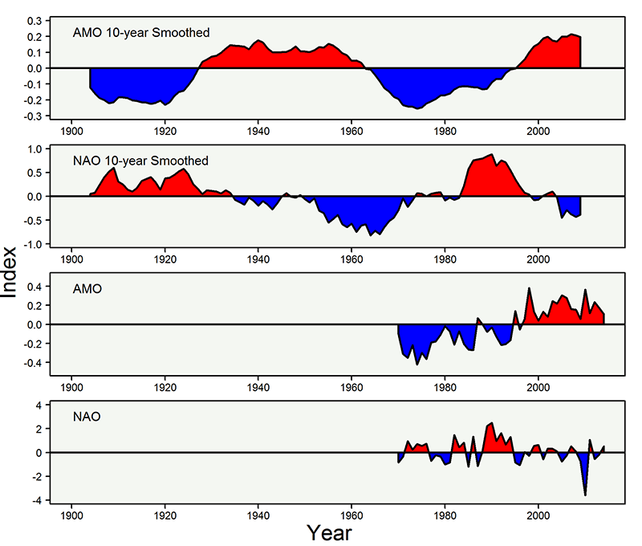
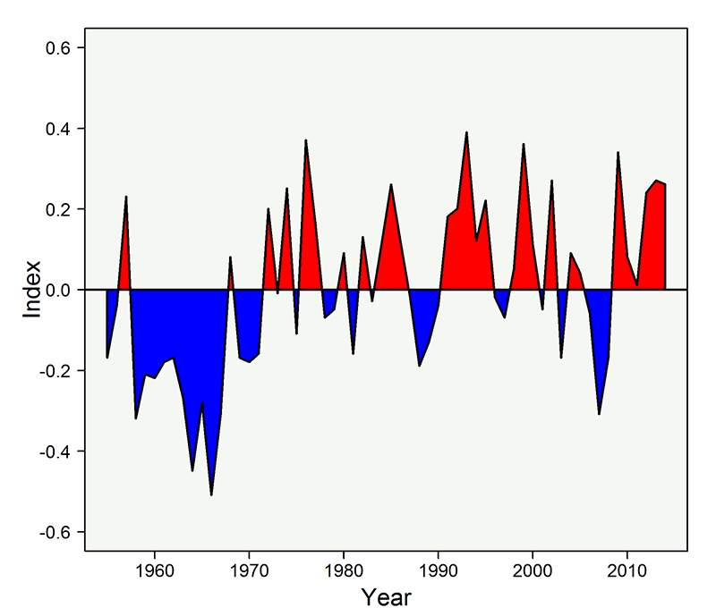
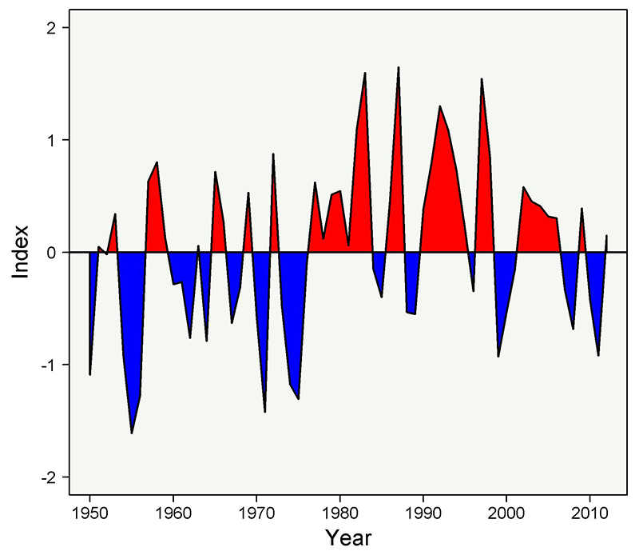
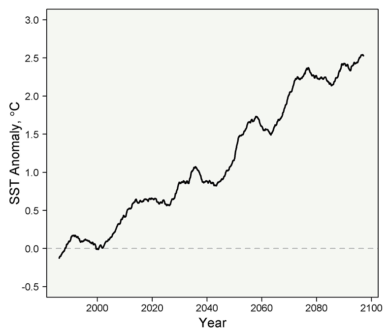
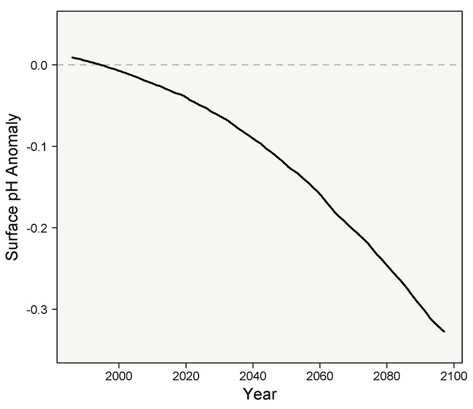

# Climate Forcing

Climate impacts the marine environment via changes in ocean temperature, biogeochemistry, vertical mixing, and circulation, all of which can affect the dynamics of marine ecosystems. The climate of the U.S. NES LME is influenced by both natural and anthropogenic factors. The continued global increase in long-lived, greenhouse gas emissions combined with the high rate of natural climate variability in the Northwest Atlantic Ocean (Messié and Chavez 2011) renders it a challenge to attribute ecosystem change to either natural or anthropogenic climate forcing. However, the observed century-scale warming of the global ocean is very likely (> 90%) caused by anthropogenic emissions of greenhouse gases (Hegerl et al. 2007). Here, we describe the historical and the most recent state of the climate of the U.S. NES LME along with projections of climate change for this region.

(\#fig:unnamed-chunk-1)The global average combined land and ocean surface temperature for the month of June 2010 was the warmest on record. The National Climatic Data Center calculated that June's average temperature was 61.1°F (16.2°C), which is 1.22°F (0.68°C) above the 20th century average of 59.9°F (15.5°C). The ERSST data shown here plots areas that were warmer than the climatic average in red, areas cooler than the average in blue, and areas around the average temperature for June in white. Almost all land on the planet experienced average or higher than average temperatures, except for a few areas of the Northwest U.S., Nordic Europe, India, and Central Australia. Image credit: NOAA Environmental Visualization Lab.

## Natural Climate Variability

### Antlantic Multidecadal Oscillation

The Atlantic Multidecadal Oscillation (AMO) is the coherent variability of sea surface temperature (SST) in the North Atlantic (0° to 70° N) after removing global mean SST anomalies (Figure 2.1). The AMO is associated with the variability of Atlantic Meridional Overturning Circulation (AMOC; Wyatt et al. 2012), which is an integral driver of the global climate (Section 3.0). Globally, the AMO accounts for 5.3% of SST variability and is the second mode of global SST variability after the Multivariate El Niño Southern Oscillation Index (Messié and Chavez 2011). There is disagreement on the periodicity of the AMO such that the time-scale is suggested to be as short as about 20 years (Chylek et al. 2011) and as long as 55 to 70 years (Knudsen et al. 2011). The warm and cool phases of the AMO have been associated with Atlantic hurricane activity, North American and European summer climate (Knight et al. 2006), and changes in the abundance and distribution of North Atlantic living marine resources ranging from phytoplankton to fish (Nye et al. 2013).

As of early 2015, the AMO has continued to persist in a positive (warm) phase since the shift from a negative (cool) phase in the late 1990s (Figure 2.1). While the mean annual SST for the year 2012 in the U.S. NES LME was the warmest on record (Section 3.0), the mean AMO index for 2012 (0.23) was not among the highest on record (0.45 in 1878; 0.38 in 1998). This pattern is consistent with historical observations such that the U.S. NES LME warms at a higher rate than the rest of the North Atlantic during the positive phase of the AMO.

(\#fig:unnamed-chunk-2)Smoothed Atlantic Multidecadal Oscillation (AMO) and North Atlantic Oscillation (NAO) indices from 1900 to 2014 using a 10-year moving average and annual AMO and NAO indices from 1970 to 2014. The AMO is derived from the Kaplan SST dataset of the North Atlantic (NOAA ESRL). The NAO is derived from the principal component-based index, which is the leading mode of sea-level pressure anomalies in the North Atlantic (Hurrell 2013).

### North Atlantic Oscillation

The North Atlantic Oscillation (NAO) is another index that has been associated with changes in physical and biological components of the North Atlantic, including the U.S. NES LME. Characterized by the north-south gradient in sea level pressure between Iceland and the Azores, the NAO fluctuates between positive (stronger wind circulation) and negative (weaker wind circulation) phases in the North Atlantic (Figure 2.1). Whereas the AMO has only recently been suggested to be a significant factor driving some of the dynamics within the U.S. NES LME, the NAO has long been linked to ecosystem change in this region. However, recent studies suggest that the relationship between the NAO and both the physical and biological components of the U.S. NES LME, particularly in the Gulf of Maine, is not consistent an appears to haven broken down since the 1990s (Hare and Kane 2012; Mountain 2012; Section 3 and Section 4). The most recent annual index from the year 2014 suggests that the NAO was in a positive phase (Figure 2.1).In 2011, the annual index was positive (1.07) but then switched back to negative in 2012 (-0.55) and 2013 (-0.19), then back to positive in 2014 (0.54).

### Gulf Stream Path

The Gulf Stream is a major component in the global climate system. Although this warm current is east of the predominate portion U.S. NES LME, its position and baroclinic transport have been associated with both the climate and biology of this ecosystem. In this region and throughout the North Atlantic, new research has helped understand the mechanisms driving both physical (Section 3) and biological changes (Section 4) associated with interannual variability in the dynamics of the Gulf Stream. An index that identifies change in this major current is the Gulf Stream Path (or Position) (Joyce and Zhang 2010). It is an index of the position of the northern component of the current based on the average latitude of the 15°C isotherm at a depth of 200 m from 75W to 55W using Levitus data (Levitus et al. 2005) (Figure 2.2).

Between 1992 and 2011, satellite altimetry data showed that the interannual variability of the Gulf Stream position had periods between 18 months to 6 years and was typically southernmost in April and northernmost in September (Lillibridge and Mariano 2013). The major factors driving the interannual variability of the position and baroclinic transport of the Gulf Stream are attributed to wind forcing, slower baroclinic waves, and the position and strength of the North Atlantic Subpolar Gyre (Lillibridge and Mariano 2013). This relationship to the North Atlantic Subpolar Gyre is the main reason why the NAO has an association with the Gulf Stream Path (Section 3). However, this relationship is out of phase such that changes in the NAO can precede changes in the Gulf Stream Path from 6 months to two years (Section 3). The out of phase relationship with the NAO is likely due to the fact that the position and strength of the Icelandic Low are much more influential to the Gulf Stream than the Azores High (Hameed and Piontkovki 2004). When the Icelandic Low strengthens, the North Atlantic Subpolar Gyre strengthens and increases the flow of the Labrador Current (Section 3) pushing the Gulf Stream further south (Hameed and Piontkovki 2004).

Since the year 1955, there has been a trend in the Gulf Stream such that its path has been expanding to the north (Figure 2.2). Although the record warm year of 2012 was associated with a more northerly Gulf Stream, it was not the "most northerly" position recorded in the time-series that goes back to 1955 (Figure 2.2).

(\#fig:unnamed-chunk-3)The Gulf Stream Path anomaly from 1955 to 2014 (based on annual means). Positive (negative) phases correspond to more northern (more southern) positions of the Gulf Stream Path

### El Niño Southern Oscillation

The El Niño Southern Oscillation (ENSO) is the primary interannual climate oscillation in the tropical Pacific Ocean. It is can be discerned via warm (El Niño) and cool (La Niña) phases in the central and eastern tropical Pacific Ocean. Because of the vast size of the Pacific Ocean, the ENSO is the predominate ocean-atmosphere fluctuation that impacts global climate variability and thus has teleconnections to many other regional climate indices including those affecting the U.S. NES LME. In the northeastern U.S., the ENSO has been associated with winter air temperature (Yu et al. 2012), precipitation (Griffiths and Bradley 2007), hurricane activity (NOAA AOML), the phase and strength of the NAO (Huang et al. 1998), and the position of the GSNW (Taylor et al. 1998).

There are many indices of the strength and variability of ENSO but the Multivariate ENSO index (MEI) has become the more common index because it is based on six primary variables over the tropical Pacific Ocean (Wolter and Timlin 2011; Figure 2.3). In 2011, the tropical Pacific was primarily in a La Niña (cool) phase and then moved toward an ENSO neutral phase throughout 2012 and 2013 followed by an El Niño phase in 2014 (NOAA NCEP). In the northeastern U.S., the El Niño phase is typically associated with above average winter precipitation while the La Nina phase is typically associated with above average winter air temperature (NOAA NCEP).

(\#fig:unnamed-chunk-4)The Multivariate ENSO index (MEI) from 1950 to 2012 (based on annual means). Positive (negative) phases correspond to warm El Niño (cool La Niña) phases of the MEI (Wolter and Timlin 2011).

## Climate Projections

The impacts of the continued increase in greenhouse gas emissions on Earth’s climate, society, and broad suite of life are assessed about every seven years by the Intergovernmental Panel on Climate Change (IPCC). The IPCC bases its various reports on global climate and Earth system models. These are highly complex, coupled atmosphere-ocean-land-ice models that are based on the laws of physics. In the most recent IPCC assessment (fifth report), Earth system models are now being included in the report. Earth system models couple complex biogeochemical models with global climate models to project climate change impacts on primary producers (i.e. trees, phytoplankton) and thus resolve critical feedbacks to biogeochemical cycles in the land, ocean, and atmosphere. Here we describe an Earth system model’s projection (up to the year 2100) of SST and surface ocean pH within the U.S. NES LME.

The Earth system model developed by the NOAA Geophysical Fluid Dynamics Laboratory (GFDL ESM2M) is among the suite of models currently being assessed by the IPCC’s fifth effort (Dunne et al. 2012; Dunne 2013). As with all models assessed by the IPCC, GFDL’s ESM2M has an average ocean resolution of about 1° x 1° and thus small, coastal areas such as the U.S. NES LME are not resolved entirely well (i.e. position and intensity of the Gulf Stream, Georges Bank, mesoscale eddies). Therefore, it is important that future climate change research for this region begins to utilize prototype, high-resolution global models, couple regional models, and statistical downscaling techniques.

### Ocean Warming

Over the past 100 years, SST in the U.S. NES LME has warmed at higher rate than any other NMFS management region nationwide (Section 3.0). The higher warming rate of this region is likely due to its close proximity and influence of the Gulf Stream. Since the year 1900, SST in subtropical western boundary currents, including the Gulf Stream, have warmed two to three times faster than the global mean (Wu et al. 2012). The enhanced warming of these currents and associated ecosystems is associated with a synchronous poleward shift and/or increase of these currents in conjunction with a change in wind forcing in both hemispheres (Wu et al. 2012). However, there is a high level of uncertainty regarding the driver(s) of the enhanced warming of these systems relative to the global mean (i.e. natural versus anthropogenic climate forcing).

Based on NOAA GFDL’s ESM2M, the SST projection for the U.S. NES LME shows a warming of about 2.5° C by the year 2100 under a high emission scenario (Figure 2.4). This warming is in addition to the observed ~0.75° C warming between 1900 and 1980 (Section 3.0). The impacts of the observed and projected warming on the living marine resources of this region are currently being investigated. A summary of these results can be found in the NEFSC Ecosystem Assessment Program’s climate change webpage.

(\#fig:unnamed-chunk-5)NOAA GFDL's ESM2M projection of SST for the US NES LME under the IPCC high emission scenario [representative concentration pathway (RCP) 8.5]. The projection is based on SST anomalies calculated by subtracting the mean value from the historical period (1981 to 2005). The plot is a smoothed, 10-year running average.

### Ocean Acidification

The increase in atmospheric carbon dioxide not only warms the planet, but also reduces ocean pH due to shifts in carbonate chemistry as the ocean uptakes a portion of the increasing carbon. The reduction in ocean pH is referred to as ocean acidification. A major impact of ocean acidification on the living marine resources of the U.S. NES LME may derive from the effects of lower pH on shell-forming organisms including mollucs, corals, echinoderms and some types of plankton (i.e. coccolithophores). The ability of these organisms to adapt to reduced pH is poorly understood and is a high priority for future research (Doney et al. 2009). The pH projection from NOAA GFDL’s ESM2M for the U.S. NES LME suggests a decrease of about -0.33 pH units by the year 2100 under a high emission scenario (Figure 2.5).

(\#fig:unnamed-chunk-6)NOAA GFDL's ESM2M projection of ocean surface pH for the U.S. NES LME under the IPCC high emission scenario [representative concentration pathway (RCP) 8.5]. The projection is based on pH anomalies calculated by subtracting the mean value from the historical period (1981 to 2005). The plot is a smoothed, 10-year running average.

